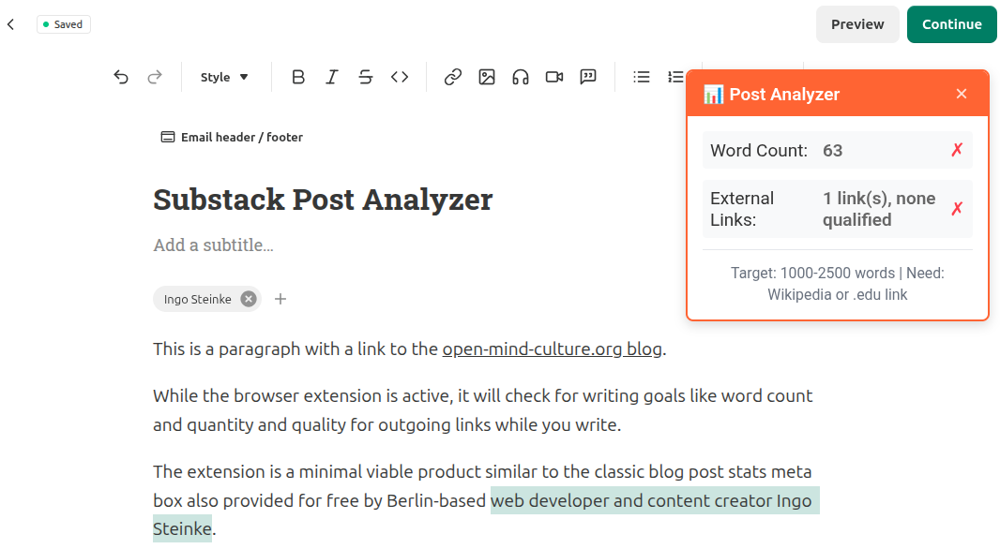

# Blog Draft Audit Chrome Extension

This Chrome extension helps content creators and editors improve their blog drafts by integrating an audit checklist alongside any blogging platform's interface that can check in real time while writing or on pressing a button. Configurable checklist items can include SEO best practices, readability checks, number of links and signals. Optionally we can specify external auditing services to review the draft content after actively submitting it for review in a new browser tab or window.

This is a work in progress, provided as open source software without any warranty. Use at your own risk. Feel free to suggest features, open issues and pull requests on GitHub.

It's originally intended to facilitate writing technical and other blog posts on WordPress, similar to the Yoast WP SEO plugin but more specific to my needs on not limited to one platform, which is why this is implemented as a browser extension, not as a CMS extension, and why it can be adapted to other blogging platforms and browsers as well. Blog platforms to test with include WordPress, DEV.to, Medium, Substack, Coder Legion, Open Mind Culture, and others web app offering to publish arbitrary lengthy user generated content either in HTML, markdown or rich text format.

Proof of concept / predecessor: [wp-content-stats-meta-box](https://github.com/openmindculture/wp-content-stats-meta-box), a simple plugin to analyze WP blog drafts on the go. Yoast SEO and Voyant might be additional inspirations while still trying to keep the service lightweight and unobtrusive.

## TODO

- [ ] #1 [Architecture, Purpose, Requirements](https://github.com/openmindculture/blog-draft-audit-chrome-extension/issues/1)
- [ ] #2 [Mozilla Firefox Extension with the same functionality](https://github.com/openmindculture/blog-draft-audit-chrome-extension/issues/2)
- [ ] build a simple MVP proof of concept extension and publish it in the Chrome Web Store

## Development and Testing Installation

1. Download or clone all extension files to a folder on your computer

2. Open Chrome and navigate to `chrome://extensions/`

3. Enable "Developer mode" (toggle in the top-right corner)

4. Click "Load unpacked"

5. Select the folder containing the extension files

6. The extension should now appear in your extensions list

## Technical Details

Blog Draft Audit Chrome Extension is a browser extension with a script to check a text field content,
- configure and/or detect likely content form field
- preconfigured content locations for wordpress post editor both in Gutenberg block editor and in WordPres classic mode, and substack, and medium, and DEV.to post authoring,
- option to check on button press
- optionally checking must be debounced after content changed,
-  and display checklist and points like a password checker or Yoast SEO score
-  if matches above criteria.
- Settings: Specify our beliefs and mission by simple string matching respecing post language.
- Beyond checking debounced while writing, optionally add buttons to submit to zerogpt, voyant tools etc. The submission URLs might be editable in settings.
- Supported source formats:
    - plain text
    - markdown
    - HTML
    - rich text

Source code preferably in TypeScript with strict linting and a very simple local build step using tsc.
Editable match strings in extension settings.
No use of external services except for optional submission to configured external validators.

## Screenshots

Working draft of an initial MVP version used while writing a new substack article.